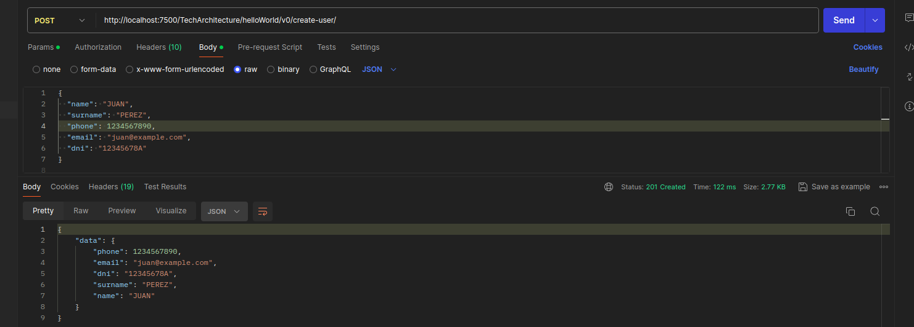
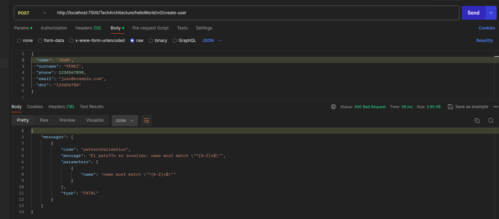
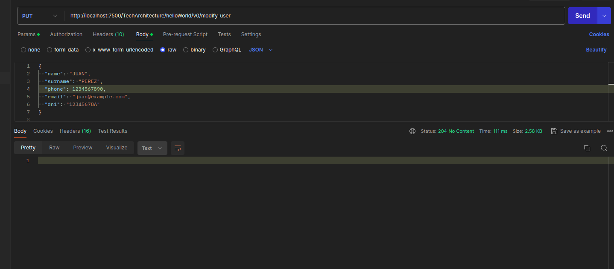
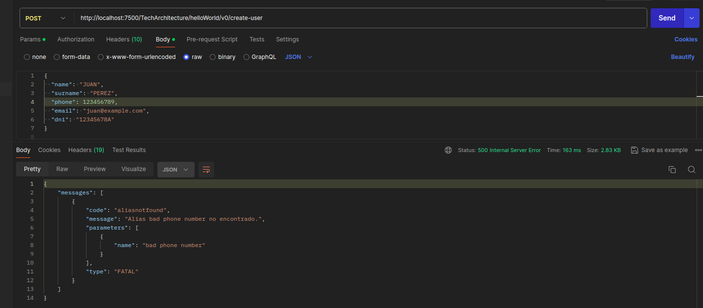

# EJERCICIO PUNTO EXTRA ASO

Se requiere desarrollar un servicio con dos endpoints utilizando el método POST y PUT/POST, respectivamente.

### VALIDACIONES

- ENTRADA POST OK -> devuelve un 201 

    

- ENTRADA POST CON ERROR -> devuelve un 400 
    

- ENTRADA PUT OK -> devuelve un 204 



- ENTRADA PUT CON ERROR -> devuelve un 400


- ENTRADA VALIDACION **PHONE**



En el DAO:

    ```
    @Override
    public BUserOut mapBUserOut(BUser bUser){
        if (!validateNumber(bUser.getPhone()))
            throw new BusinessServiceException("bad phone number");
        ....
    }


